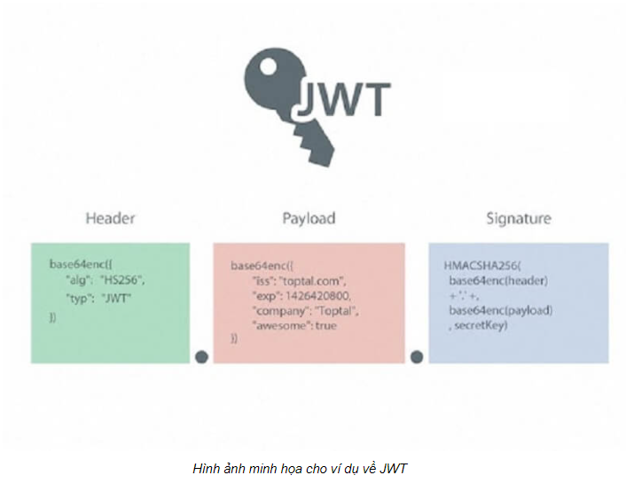

## JWT là gì ? 
### JWT là Json Web Token . Nó đại diện như một chiếc chìa khóa để yêu cầu mở thử client đến server.
## JWT cấu tạo như thế nào 
### JWT cấu tạo chính gồm 3 phần là Header,Payload và Signature => một Token sẽ có dạng Header.Payload.Sinature 
##  Phân tích 3 thành phần trong JWT 
## Hình ảnh minh họa nếu sử dụng GateWay 

### Header 
* Header có 2 thành phần chính : 
	- Typ(Type): Type là  loại token được xác định là JWT
	- ALG (Algorithm) :ALG là loại mã hóa mới tương tự như SHA256,RSA
    => ví dụ : {
				  "ALG": "HS256",
				  "TYP": "JWT"
				}
* Payload : Payload chứa claim => thông thường claim được chia thành 3 loại : Reserved , Public ,Private
		 Reserved: đây là những thông tin đã được quy định trong IANA JSON Web Token Claims registry. Tuy nhiên, những thông tin này không mang tính bắt buộc. Bạn có thể tùy vào từng ứng dụng khác nhau mà bạn có thể để đặt ra những điều kiện ràng buộc đối với những thông tin cần thiết nhất. Ví dụ như:

		iss (issuer): tổ chức phát hành của Token

		sub (subject): chủ đề Token

		aud (audience): đối tượng sử dụng Token

		exp (expired time): thời điểm token sẽ hết hạn

		nbf (not before time): token chưa hợp lệ trước thời điểm này

		iat (issued at): thời điểm token sẽ được phát hành, tính theo UNIX time

		jti: ID của JWT

		Public: Được định nghĩa tùy theo ý muốn của người sử dụng JWT. Tuy nhiên để tránh tình trạng trùng lặp xảy ra thì nên được quy định ở trong IANA JSON Web Token Registry hoặc là 1 URL có chứa không gian tên không bị trùng lặp.

		Private: Đây là phần thông tin thêm được dùng để truyền tải qua lại giữa các máy khách với nhau
	=> ví dụ : {
				  "sub": "1234567890",
				  "name": "John Doe",
				  "iat": 1516239021
				}
*Sinature => Sinature = Header + Payload
